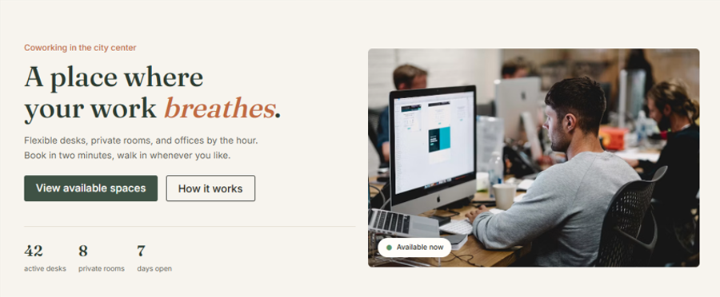
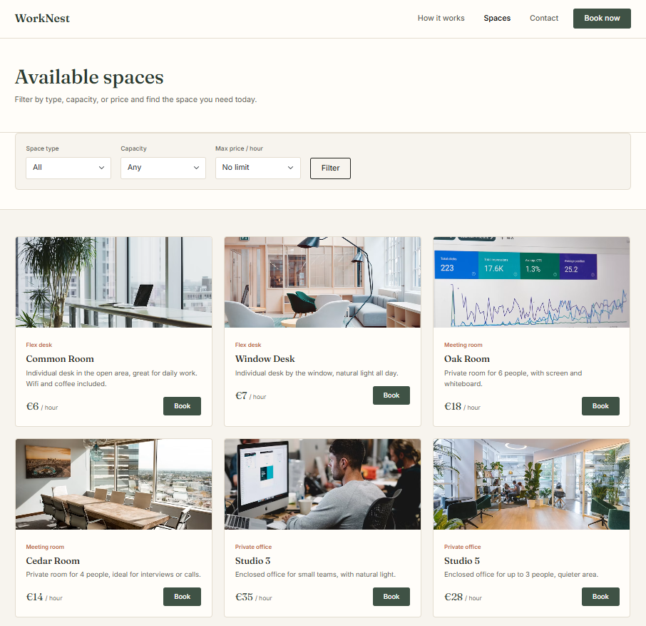
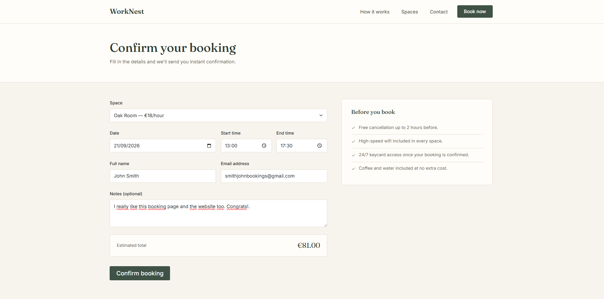
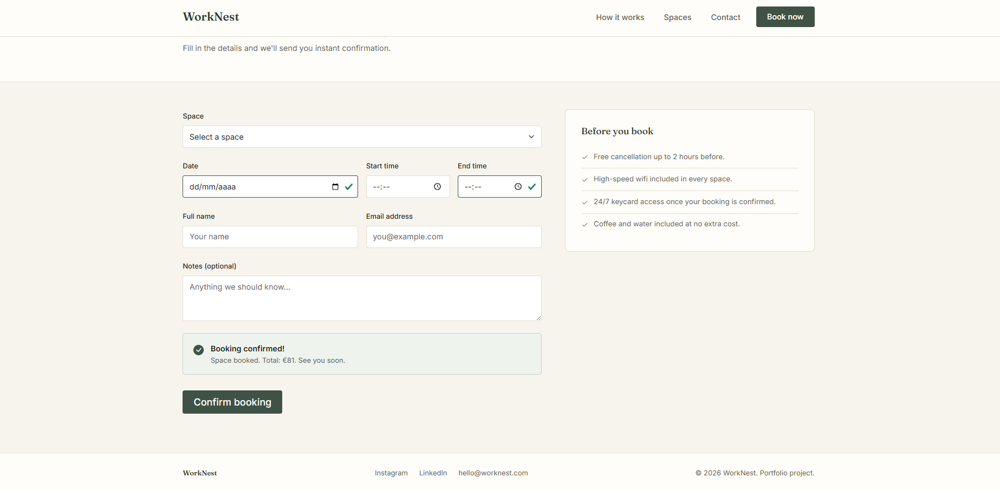
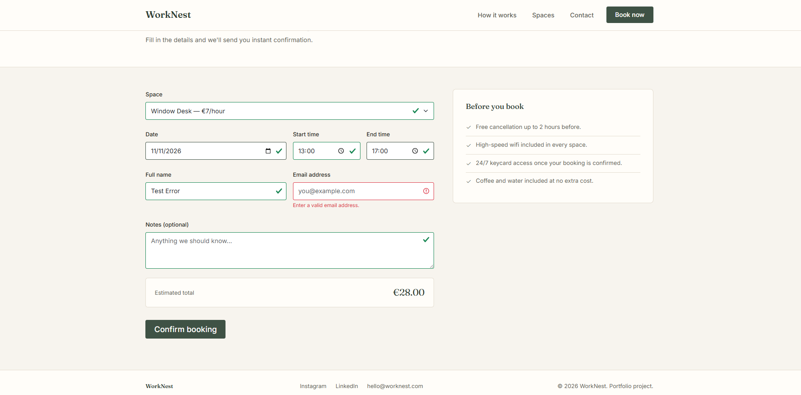
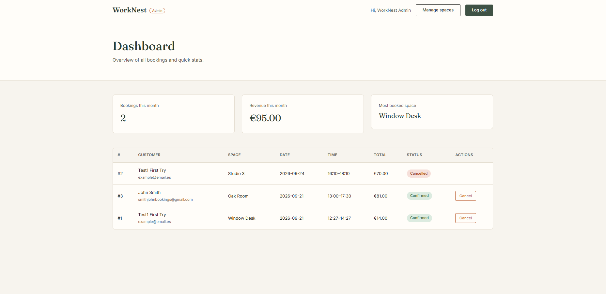
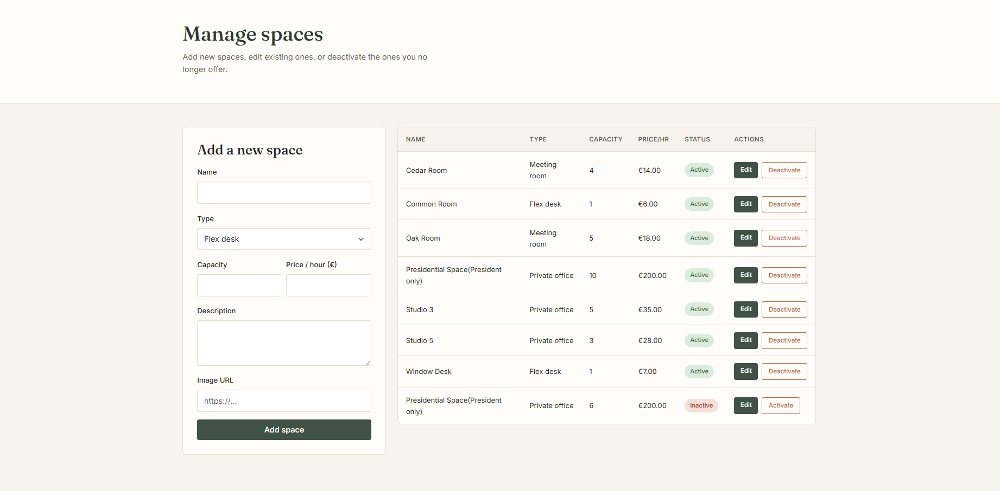
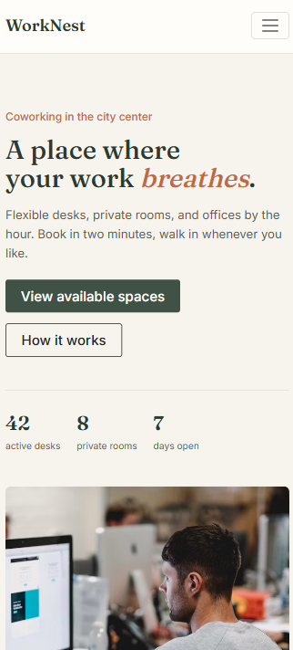
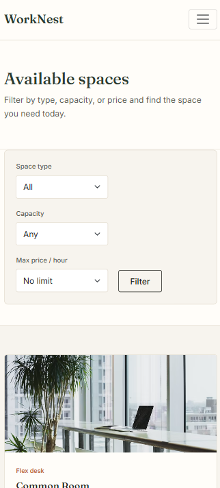

# WorkNest — Coworking Space Booking App

> A full-stack web app for browsing and booking coworking spaces, built as a portfolio project while completing my web development training.



## 💡 About this project

WorkNest is a fictional coworking space that lets people browse available desks, meeting rooms, and private offices, and book them online in real time. It's a reimagined, expanded version of a classic "hotel booking" exercise — instead of a hotel, I built it around a coworking space, and instead of stopping at a basic CRUD, I pushed it further: real-time availability checks, an admin dashboard with live stats, and full space management.

I built this project to apply what I've learned so far in my training (frontend fundamentals, some backend, and databases) into something that feels like a real, usable product — not just a class exercise.

## ✨ Features

**Public site**
- Landing page and space listing connected live to a MySQL database (no hardcoded content)
- Filters by space type, capacity, and price
- Booking form with two layers of validation: instant feedback in the browser (JavaScript) and a second, non-skippable check on the server (PHP) — because client-side validation alone can always be bypassed
- Overlap protection: the same space can't be double-booked for overlapping time slots, enforced at the database query level

**Admin panel**
- Session-based login, protected server-side (not just hidden with CSS/JS)
- Dashboard with live stats: bookings this month, revenue this month, most booked space — calculated with SQL aggregation, not fetched-and-counted in PHP
- Bookings table with one-click status changes (confirm / cancel)
- Full space management: create, edit, and deactivate spaces (spaces are never hard-deleted, to avoid breaking historical bookings linked to them)

## 🛠️ Built with

| Layer | Technology |
|---|---|
| Structure & styling | HTML5, CSS3, Bootstrap 5 |
| Interactivity | Vanilla JavaScript (fetch API, form validation, DOM manipulation) |
| Backend | PHP (PDO with prepared statements) |
| Database | MySQL |

No frameworks beyond Bootstrap — this was intentional, to make sure the fundamentals were solid before reaching for something like React or Laravel.

## 📸 Screenshots

### Browsing available spaces


### Booking flow with validation
|  
|  
| |

### Admin dashboard


### Space management


### Mobile view



## 🗄️ Database structure

Three tables, kept intentionally simple but with real relational logic:

```
users        → id, name, email, password (hashed), role, created_at
spaces       → id, name, type, capacity, price_per_hour, description, image, active
bookings     → id, user_id (FK), space_id (FK), booking_date, start_time, end_time, status, total_price
```

The `bookings` table has a `CHECK` constraint ensuring `end_time > start_time`, and the booking endpoint runs a query checking for overlapping time ranges before confirming — that logic lives in [`php/create_booking.php`](php/create_booking.php).

Full schema with sample data: [`database.sql`](database.sql).

## 🚀 Running it locally

This project needs a PHP + MySQL environment. The easiest way is [XAMPP](https://www.apachefriends.org/):

1. Install XAMPP and start **Apache** and **MySQL** from its control panel
2. Copy this project folder into `htdocs` (e.g. `C:\xampp\htdocs\coworking-app`)
3. Open `http://localhost/phpmyadmin`, create a database, and import `database.sql`
4. Open `php/connection.php` and set your MySQL username/password if different from the defaults
5. Visit `http://localhost/coworking-app/index.html`

To try the admin panel, you'll need a real password hash in the `users` table (the one included is a placeholder). Generate one with PHP's `password_hash()`, or temporarily create a small script that runs `password_hash('yourpassword', PASSWORD_DEFAULT)` and paste the result into the `password` column for the admin row.

## 🔭 What I'd add with more time

- Customer login, so people can view and cancel their own bookings without re-entering their email every time
- Email confirmation when a booking is made
- Calendar-style availability view instead of picking a date/time blind
- Automated tests for the booking overlap logic, since it's the trickiest piece of business logic in the project

## 🎓 A note on where I'm at

I'm currently finishing my web development training (about a year left), so this project reflects where I am right now rather than a finished, production-grade app. Frontend (HTML, CSS, Bootstrap, some JavaScript) is where I'm most comfortable; PHP, MySQL, and Java are what I'm actively building up. Building WorkNest end-to-end — including debugging real issues like file paths, database constraints, and session handling — has been the most useful part of my learning so far, more than any single tutorial.

---

*Feel free to explore the code, and reach out if you have feedback — I'm always looking to improve.*
